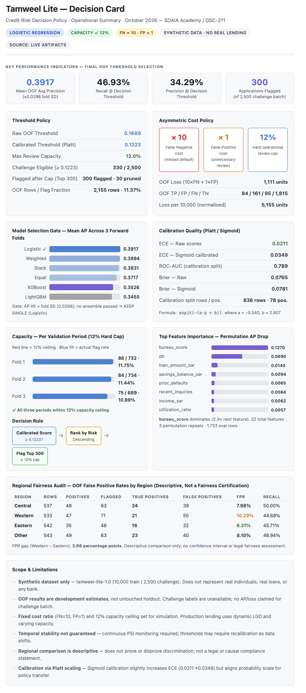
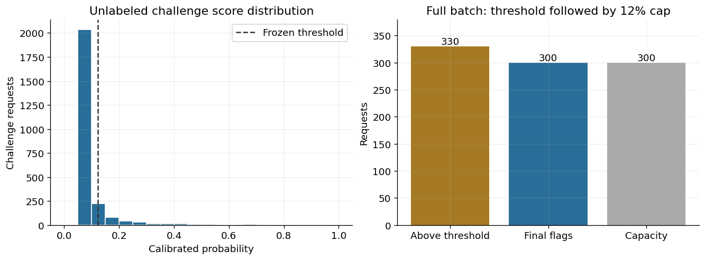
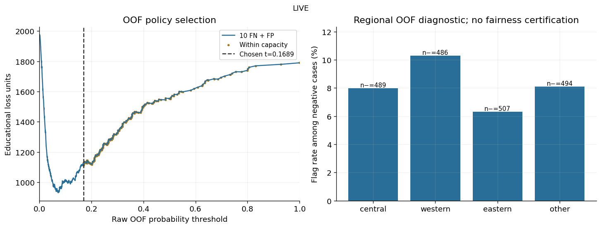
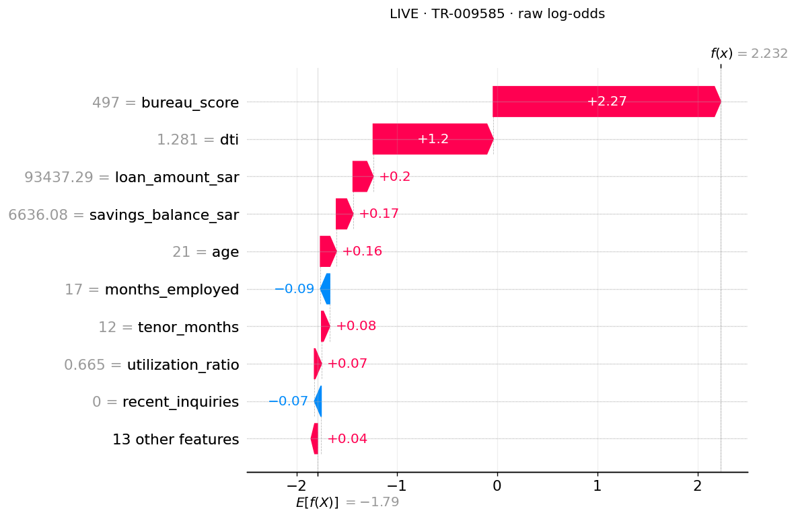
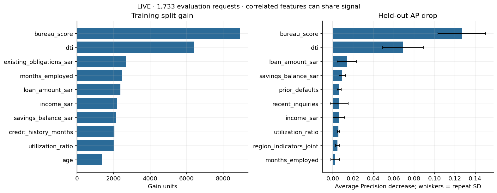
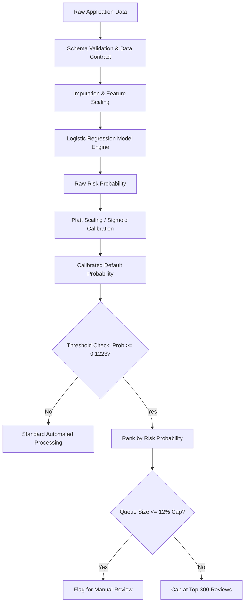

# Tamweel Lite — Credit Risk Decision Modeling & Pipeline

**Developer:** Sarah Alqahtani **Project Type:** Individual Capstone Project

[](https://colab.research.google.com/github/sarahliic/tamweel-project-lite-sda-dsc-211-sarah-alqahtani/blob/main/notebooks/99_final_submission_check.ipynb)


<p align="center">
  
</p>

## Project Overview
**Tamweel Lite** is an end-to-end credit risk assessment and decisioning system. It predicts retail loan default within 90 days (`default_within_90d`) and translates model risk probabilities into an operational review policy under asymmetric default costs and strict review capacity constraints (12% maximum queue limit).

Key highlights:
- **Leakage-Free Temporal Validation**: 3-period forward validation with a 90-day outcome maturity buffer and customer clustering.
- **Model Gating**: Systematic comparison of Logistic Regression, LightGBM, XGBoost, and Stacking/Averaging ensembles.
- **Cost-Sensitive Decision Policy**: Cost optimization ($10 \times \text{FN} + 1 \times \text{FP}$) under an operational 12% review cap.
- **Probability Calibration & Reliability**: Platt scaling (Sigmoid) on reserved holdout splits.
- **Explainability & Auditing**: Global/local SHAP analysis, permutation importance, and regional error audits.

---

## Key Results

| Metric / Parameter | Value | Details |
| :--- | :---: | :--- |
| **Selected Final Model** | **Logistic Regression** | Outperformed tree ensembles across all forward validation folds |
| **Mean OOF Average Precision (AP)** | **0.3917** (±0.0298) | Higher ranking precision than XGBoost (0.3526) & LightGBM (0.3455) |
| **Raw Decision Threshold** | **0.1689** | Cost-optimal threshold on raw validation scores |
| **Calibrated Decision Threshold** | **0.1223** | Transferred threshold via Platt scaling sigmoid |
| **Recall @ Constrained Threshold** | **46.93%** | Captures ~47% of high-risk defaults within operational limits |
| **Precision @ Constrained Threshold** | **34.29%** | ~1 in 3 flagged applications is a true default |
| **Operational Capacity Ceiling** | **12.0%** (300 / 2,500) | Strictly respects maximum human review capacity |
| **Challenge Batch Review Flags** | **300 flagged** | Top 300 risk-ranked applications flagged from 330 eligible |
| **Calibration Quality (ECE)** | **0.0211** (Raw) / **0.0349** (Sigmoid) | Low Expected Calibration Error across decile probability bins |

### Key Workflow & Reliability Visualizations
| Calibration & Reliability Fit | Challenge Batch Review Capacity |
| :---: | :---: |
| <br>*(Path: `artifacts/day5_calibration_fit.png`)* | <br>*(Path: `artifacts/day5_challenge_capacity.png`)* |

---

## Threshold & Cost Analysis

In credit risk, missing a default (False Negative) is substantially costlier than an unnecessary review (False Positive).

- **Cost Matrix**: $\text{Cost}(FN) = 10 \text{ units}$, $\text{Cost}(FP) = 1 \text{ unit}$.
- **Loss Function**: $\text{Loss} = 10 \times FN + 1 \times FP$.
- **Hard Operational Cap**: Review flag budget $\le 12\%$ of total batch volume.

| Cost Curve & Optimal Threshold | Capacity Regions Across Periods |
| :---: | :---: |
| <br>*(Path: `artifacts/cost_curve.png`)* | <br>*(Path: `artifacts/day5_policy_regions.png`)* |

**Challenge Batch Application (2,500 rows):**
- 330 applicants met or exceeded the calibrated risk threshold of $0.1223$.
- Under the 12% review budget cap (300 slots), the top 300 highest-risk applications were flagged, safely pruning 30 borderline cases.

---

## Explainability

| Global SHAP Feature Importance | Local Instance Attribution (TR-009585) |
| :---: | :---: |
| <br>*(Path: `artifacts/shap_beeswarm.png`)* | <br>*(Path: `artifacts/shap_waterfall.png`)* |

### Key Risk Drivers
1. **`bureau_score`**: Primary predictor of risk; lower scores sharply increase default probability (Permutation AP drop $\approx 0.127$).
2. **`dti`**: Debt-to-income ratio; commitments above 100% of income strongly drive risk (Permutation AP drop $\approx 0.070$).
3. **`loan_amount_sar` & `savings_balance_sar`**: Exposure volume and liquidity reserves.

| Permutation Feature Importance | Reliability Curve & Calibration |
| :---: | :---: |
| <br>*(Path: `artifacts/permutation_importance.png`)* | <br>*(Path: `artifacts/reliability_curve.png`)* |

---

## Final Model

- **Model Artifact**: [`artifacts/final_model/model.json`](artifacts/final_model/model.json)
- **Model Manifest**: [`artifacts/final_model/model_manifest.json`](artifacts/final_model/model_manifest.json)
- **Policy Mapping**: [`artifacts/final_policy.json`](artifacts/final_policy.json)
- **Predictors (22 Features)**: Standard pre-application demographic, income, loan, and credit history features (strict zero lookahead leakage).

---

## Technical Pipeline



---

## Repository Structure

```
├── data/                 # Training, challenge data, dictionary & schema contract
├── notebooks/            # Step-by-step workflow (00 Setup → 05 Final Delivery → 99 Check)
├── scripts/              # Production inference, data checks, rebuild & replay utilities
├── artifacts/            # Serialized model, calibrated policy, run metrics & plots
├── reports/              # Bilingual Model Card, Decision Card & Interpretability Report
├── presentation/         # Final project presentation deck (PDF)
├── submission/           # Challenge batch predictions & checksum manifest
├── requirements-colab.txt# Python environment dependencies
└── constraints.txt       # Environment, resource & compute constraints
```

---

## Quick Start

### 1. Environment Setup
```bash
git clone https://github.com/SDAIAAcademy/tamweel-project-lite-sda-dsc-211-sarah-alqahtani.git
cd tamweel-project-lite-sda-dsc-211-sarah-alqahtani

python3 -m venv .venv
source .venv/bin/activate
pip install -r requirements-colab.txt
```

### 2. Run Inference
```bash
python scripts/inference.py --input data/tamweel_challenge.csv --output artifacts/challenge_predictions.csv
```

### 3. Rebuild / Retrain Final Model
```bash
python scripts/rebuild_final.py
```

### 4. Replay and Verify Saved Deliverables
```bash
python scripts/replay_final.py
```

---

## Dataset

- **Type**: Synthetic retail credit risk dataset (`tamweel-lite-1.0`).
- **Target**: `default_within_90d` (1 = default within 90 days of application; 0 = non-default).
- **Size**: 10,000 training records (2022–2024), 2,500 challenge evaluation records (2025).
- **Features**: 22 strictly pre-application predictor variables.
- **Leakage Controls**: Customer IDs, dates, and post-outcome monitoring columns (`days_past_due_60`, `collection_calls`) are excluded from model training.

---

## Limitations

1. **Synthetic Nature**: The dataset is simulated and does not represent actual individuals, real loans, or real banks.
2. **Fixed Cost Assumption**: Cost ratio ($10 \times \text{FN} + 1 \times \text{FP}$) and 12% capacity ceiling are set for simulation purposes; production lending uses dynamic loss-given-default (LGD).
3. **Temporal Stability**: Validation spans historical periods; continuous Population Stability Index (PSI) monitoring is necessary for production drift tracking.
4. **Fairness Diagnostics**: Regional subgroup comparisons are descriptive checks and do not represent formal legal or causal compliance certifications.

---

## Links / Attribution

- **Model Card**: [`reports/MODEL_CARD.md`](reports/MODEL_CARD.md)
- **Decision Policy Card**: [`reports/DECISION_CARD.md`](reports/DECISION_CARD.md)
- **Interpretability Report**: [`reports/INTERPRETABILITY_REPORT.md`](reports/INTERPRETABILITY_REPORT.md)

---

## Training-program attribution

This project was completed for the **Tamweel Lite for Developers with ML** capstone, delivered by **SDAIA Academy via Learning Space** as a five-day, on-site, 20-hour program. Session: **October 2026**.

Training-program reference: [SDAIA Academy on GitHub](https://github.com/SDAIAAcademy).
